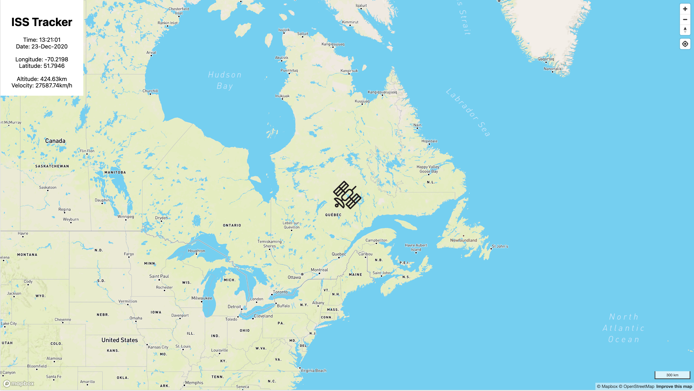

# iss_tracker

Version 2.0 of an ISS tracker built with Vue.js using a different API from version 1.0 for relevant infomation. This app also uses MapBox for it's map. Version 1.0 can be found [here](https://github.com/JenkenK/iss_tracker)

## Image of ISS Tracker App Running on Browser



## Project setup
```
npm install
```

### Compiles and hot-reloads for development
```
npm run serve
```

### Compiles and minifies for production
```
npm run build
```

### Lints and fixes files
```
npm run lint
```

### Customize configuration
See [Configuration Reference](https://cli.vuejs.org/config/).
